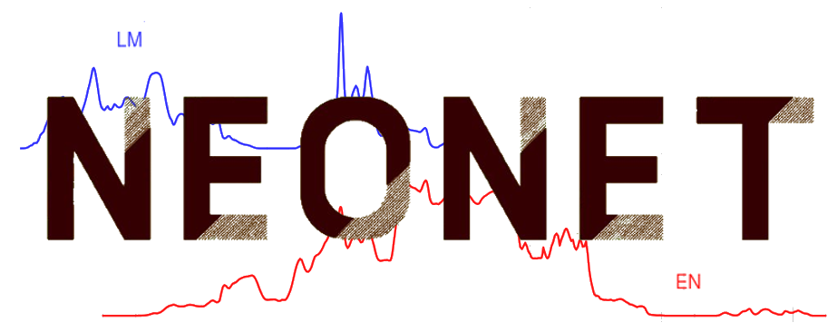
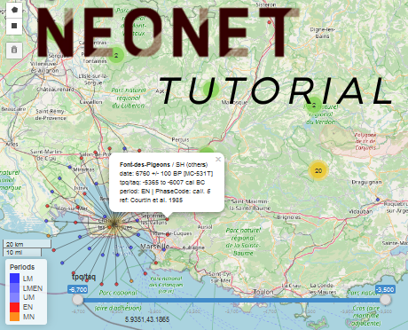

## Thomas Huet (Dr.) 
>  **Prehistory and Computational Archaeology**. My main research projects cover the Neolithic of Western Asia and its embedded iconography  

[LabEx ARCHIMEDE](https://archimede.cnrs.fr/), Associate Researcher UMR 5140 ASM-CNRS, Université Paul-Valéry Montpellier 3, France

  thomashuet7@gmail.com  

  [professional page](https://archimede.cnrs.fr/index.php/annuaire/123-annuaire/e-h/456-thomas-huet) 

  [CV](https://github.com/zoometh/thomashuet.github.io/raw/main/cv/cv_english.pdf)  

  [0000-0002-1112-6122](https://orcid.org/0000-0002-1112-6122)

  [zoometh](https://github.com/zoometh)

  [2hKEVaIAAAAJ&hl](https://scholar.google.fr/citations?user=2hKEVaIAAAAJ&hl=en&oi=sra)

  [Thomas_Huet2](https://www.researchgate.net/profile/Thomas_Huet2)  
  
 

---

### PROJECTS

<table style="width:100%">
	<tr align="center">
		<td>
			
		</td><td>
			
		</td>
	</tr><tr>
			  <th style="padding:10px">R package iconr. Set of formal methods for studying archaeological iconographic datasets (rock-art, pottery decoration, stelae, etc.) using network and spatial analysis</th>
		    <th style="padding:10px">Multi-paradigm and multi-scale rock-art management with open-source apps (3D, webmapping, etc.)</th>
	</tr><tr align="center">
		<td>
			
		</td><td>
					
		</td>
	</tr><tr>
			<th style="padding:10px">NeoNet app. RShiny interactive web application for selecting, calibrating, summing and plotting on-the-fly radiocarbon dates to model the Mesolithic/Neolithic transition</th>
		<th style="padding:10px">NeoNet tutorial webpage</th>
		</tr><tr align="center">
      <td>
			
		</td><td>
			
		</td>
	</tr>
	<tr>
		<th style="padding:10px">Linked Open Data (LOD), <i>Science Ouverte</i>, computing methods and concepts for the a FAIR open science: the case of Archaeology </th>
		<th style="padding:10px">Networks drawing (graph theory, spatial networks) and enriched data visualization of movable goods (personal ornements, imported/prestige goods) during the First Iron Age in Northern Italy (Golasecca culture)</th>
	</tr><tr align="center">
      <td>
			
		</td><td>
			
		</td>
	</tr>
	<tr>
		<th style="padding:10px">Reuse of gene-culture data for co-evolution studies through cross-analysis of aDNA data, culture tags and radiocarbon dates</th>
		<th style="padding:10px">Landscape Archaeology theory and methods: reuse of data with management of LiDAR surveys, shapefiles, etc.</th>
	</tr>
</table>

  
---
