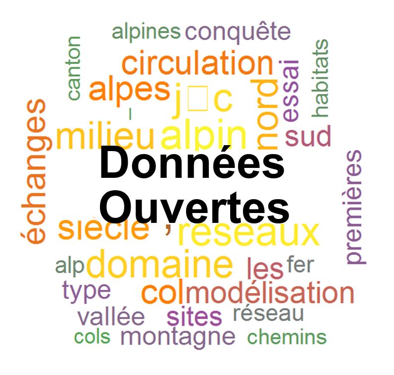
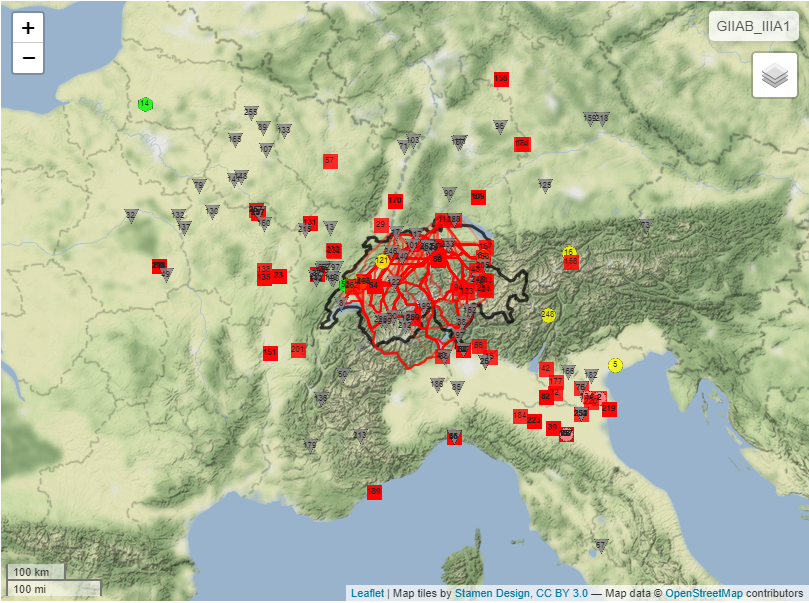
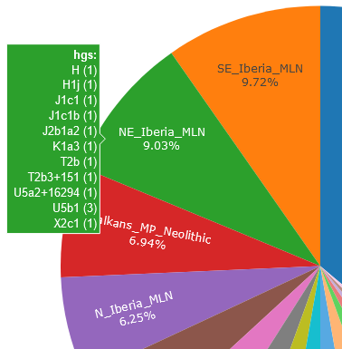
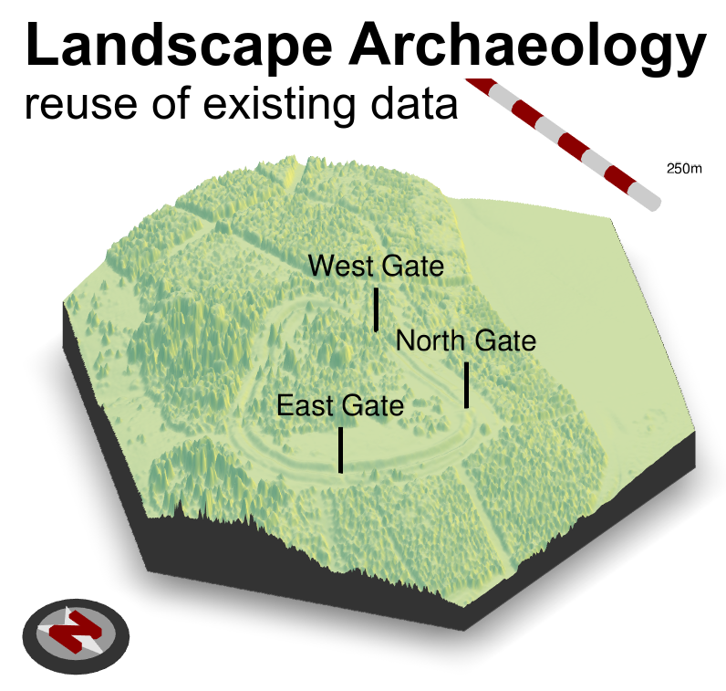
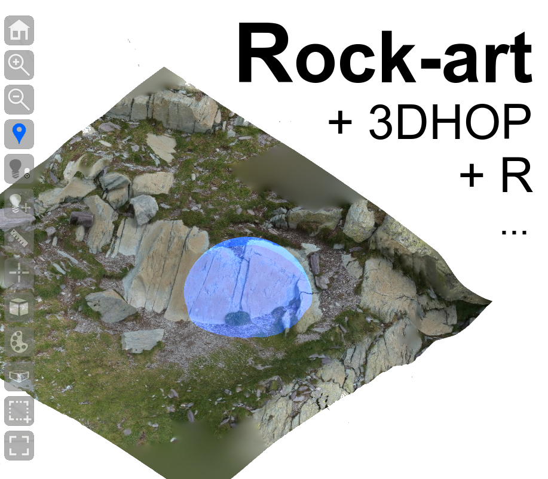

## Dr Thomas Huet 

- Researcher and Database Manager, EAMENA project
University of Oxford, School of Archaeology
2 South Parks Road, Oxford OX1 3TG, United Kingdom

- Associate Researcher, UMR 5140, ASM-CNRS, Université Montpellier 3

  

  thomas.huet@arch.ox.ac.uk | thomashuet7@gmail.com |  

  [School of Archaeology](https://archit.web.ox.ac.uk/people/dr-thomas-huet), [EAMENA project](https://eamena.web.ox.ac.uk/user)

  +44 (0)1865 611660

  [CV](https://github.com/zoometh/thomashuet/blob/main/cv/cv_english.pdf)           

  [0000-0002-1112-6122](https://orcid.org/0000-0002-1112-6122)

  [zoometh](https://github.com/zoometh)

  [2hKEVaIAAAAJ&hl](https://scholar.google.fr/citations?user=2hKEVaIAAAAJ&hl=en&oi=sra)

  [Thomas_Huet2](https://www.researchgate.net/profile/Thomas_Huet2)  
  
 

---

<b> Prehistory and Computational Archaeology </b>  My main research interests cover the Late Prehistory of Western Asia and its embedded iconography 
 

---

### EAMENA PROJECT
> *Endangered Archaeology in the Middle East & North Africa* (EAMENA), Oxford

<ul>
  <li>project: https://eamena.web.ox.ac.uk</li>
  <li>GitHub: https://github.com/eamena-oxford </li>
</ul>

### OTHER PROJECTS

<table style="width:100%">
	<tr align="center">
		<td>
			
		</td><td>
			
		</td>
	</tr><tr>
			  <th style="padding:10px">R package iconr. Set of formal methods for studying archaeological iconographic datasets (rock-art, pottery decoration, stelae, etc.) using network, spatial, and geometric morphometry analysis</th>
			  <th style="padding:10px">  Sauri - Pallars (project Universitat Autònoma de Barcelona - Departament de Prehistòria). Database, webmapping, statistical analysis and FAIR data of Sauri (Pallars Sobira, Lleida) medieval rock-art</th>
	</tr><tr align="center">
		<td>
			
		</td><td>
					
		</td>
	</tr><tr>
			<th style="padding:10px">NeoNet app stable version. RShiny interactive web application for selecting, calibrating, summing and plotting on-the-fly radiocarbon dates to model the Mesolithic/Neolithic transition, hosted by the University of Pisa</th>
		<th style="padding:10px">NeoNet app development version, hosted on GitHub</th>
		</tr><tr align="center">
      <td>
			
		</td><td>
			
		</td>
	</tr>
	<tr>
		<th style="padding:10px">Linked Open Data (LOD), <i>Science Ouverte</i>, computing methods and concepts for the a FAIR open science: the case of Archaeology </th>
		<th style="padding:10px">Networks drawing (graph theory, spatial networks) and enriched data visualization of movable goods (personal ornements, imported/prestige goods) during the First Iron Age in Northern Italy (Golasecca culture)</th>
	</tr><tr align="center">
		<td>
			
		</td><td>
			
		</td>
	</tr><tr>
		<th style="padding:10px">Reuse of gene-culture data for co-evolution studies through cross-analysis of aDNA data, culture tags and radiocarbon dates</th>
		<th style="padding:10px">Landscape Archaeology theory and methods: reuse of data with management of LiDAR surveys, shapefiles, etc.</th>
	</tr><tr align="center">
		<td>
			
		</td><td>
			
		</td>
	</tr><tr>
		    <th style="padding:10px">Multi-paradigm and multi-scale 3D management of rock-art, artifacts, etc., with open-source apps</th>
		<th style="padding:10px">R package Zoowork : Methods for Zooarchaeology</th>
</table>

  
---
