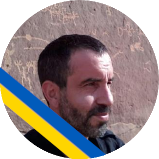
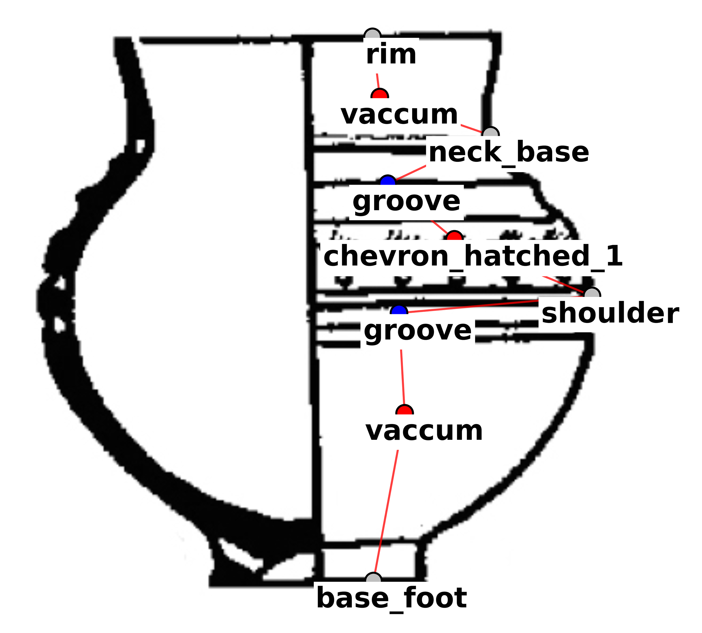

## Thomas Huet (Dr.) 
>  **Prehistory and Computational Archaeology**. My main research projects cover the Neolithic of Western Asia and its embedded iconography  

[LabEx ARCHIMEDE](https://archimede.cnrs.fr/), Associate Researcher UMR 5140 ASM-CNRS, Université Paul-Valéry Montpellier 3, France

  thomashuet7@gmail.com  

  [professional page](https://archimede.cnrs.fr/index.php/annuaire/123-annuaire/e-h/456-thomas-huet) 

  [CV](https://github.com/zoometh/thomashuet.github.io/raw/main/cv/cv_english.pdf)  

  [0000-0002-1112-6122](https://orcid.org/0000-0002-1112-6122)

  [zoometh](https://github.com/zoometh)

  [2hKEVaIAAAAJ&hl](https://scholar.google.fr/citations?user=2hKEVaIAAAAJ&hl=en&oi=sra)

  [Thomas_Huet2](https://www.researchgate.net/profile/Thomas_Huet2)  

 
  
**There** is probably a natural history of human societies. Quetelet's concept of "average man" (*homme moyen*) or Tobler's first law of geography, show that parsimonial, multiscalar, bottom-up and agglomerative methods are suitable to describe data and datasets. Multifactorial, unsupervised and data-driven analysis ([example analysis](https://epispat.shinyapps.io/analyses_mult_5/)) are favored since we did not know, *a priori*, what aspects and at which scale (from the settlement to the continent) will give the positive results. The recurrent and relevant patterns will be identified *a posteriori*. 

## Theory

Historical sciences operate by comparison, evaluating the similarities and the differences between two or more autonomous populations, groups, cultures, settlements, etc. The archaeological investigation can be divided into 4 dimensions (W4) to address the questions [***'Why?'*** and ***'How?'***](https://github.com/zoometh/thomashuet/blob/main/README.md#why)) evoluate past societies:

* ***'What?'*** ([culture](https://github.com/zoometh/thomashuet/blob/main/README.md#what)) participate to the historical processes
* ***'Where?'*** ([geography](https://github.com/zoometh/thomashuet/blob/main/README.md#where)) did these historical processes occurred
* ***'When?'*** ([time](https://github.com/zoometh/thomashuet/blob/main/README.md#when)) did these processes historical occurred
* ***'Who?'*** ([genetic](https://github.com/zoometh/thomashuet/blob/main/README.md#who)) participate to these historical processes

The Cartesian product of these lines of evidence are resumed in my web docs under the concept of [Gene-Culure coevolution](https://github.com/zoometh/aDNA#gene-culture-coevolution).

### H0 and H1

The hypothesis H0 is the null hypothesis, normal distribution, homogeneity of variances, same populations, etc., its W4 variants are:
  + ***'What?'***: cultural consensus, homophily, homogeneity of cultural traits, social affinity, social proximity, cultural affinity, cultural proximity, etc. 
  + ***'When?'***: time continuity principle, gradual patterns, etc.
  + ***'Where?'***: space continuity principle, homogeneous space, isotropic space, etc. 
  + ***'Who?'***: molecular clock, random genetic drifts, population continuity, PC, neutral mutation, genetic drift alone, *mutation dans le temps*, etc. 

The opposite hypothesis is the H1 hypothesis. Its W4 variants are:
  + ***'What?'***: cultural evolution, ethnicity, cultural change, heterogeneity of cultural traits, *dérive historique*, etc. 
  + ***'When?'***: emergence, etc.
  + ***'Where?'***: heterogeneous space, anisotropic space, etc. 
  + ***'Who?'***: genetic dissimilarity, genetic distance, demic diffusion, etc. 

### What
> "Cultural consensus leads to ethnicity" (Juan Anton Barceló Alvarez)

Cultural identity is the product of a set of cultural traits. Cultural traits are considered in terms of presence/absence, relative quantities and correlations of various items belonging to material (raw material, settlements, etc.) and practices (technical, symbolic, etc.). A cultural trait can be shared (at different degrees), or not, by different groups. Renfrew and Bahn (1991)[[1]](#1) have modeled the different cultural subsystems:

| subsystem   | description  | 
|-------------|-------------|
|subsistence  |  interactions around food resources |
|technological |  set of *chaines opératoires* for artifacts production |
|social |  set of inter-individuals and intra-group interactions |
|symbolic |  languages, [picture production](https://github.com/zoometh/thomashuet/blob/main/README.md#iconography-), religions, etc. |
|external trade   |  trade exchanges inter-groups |
|demographic   | population size (scale factor) |
|ecological   |  set of natural features |

Study of archaeological cultures will permit to respond to the question:
'What ?'. It will contribute to define the cultural identity of the
social groups. For example, Impressa-Cardial complex (ICC) is named
after its ceramic characteristics (impressed and *cardium* decorations)
and is associated to different cultural traits: settlement
particularities (e.g. proximity to sea shore), production economy (e.g.
wheat, domestic goats), specific diet (cereal-based consumption), etc.
There is no consensus on which cultural traits (e.g. ceramic
productions, settlements system, diet) have to be selected in order to
compare and measure cultural (dis)similarities. Each selection of these
traits will have to be explicitly justified. Commonly, cultural traits
will be selected into the different subsystems of a social group
organization [[1]](#1): subsistence (e.g. relative % of domestic and
wild animals consumption), technological (e.g. presence/absence of loom
weights), social (e.g. social hierarchy), symbolic (e.g.
iconography), external trade (e.g. presence/absence of long-distance
exchanges) and demographics (e.g. average ages of death). A key notion,
for the cultural dimension, is the notion of *chaîne opératoire* (CO).
The CO is a sequence of technical gestures, following the same order,
that transform the raw material into a usable product [[2]](#2).
Beside the technical constraints (i.e. the technical efficiency), the
more complex is the CO, the less likely two different cultures could
share the same CO without having any previous cultural interactions
(i.e. trait-adoptions). In this way, complex COs are close to the notion
of *style*: a \"highly specific and characteristic manner of doing
something (\...) always peculiar to a specific time and place\"
[[3]](#3). Studies of complex COs cover numerous fields of social
activities (e.g. acquisition, production, shaping, trade and use of
lithic materials) and are key values concerning the recognition of
trait-adoptions. Just like significant changes in the demographic
subsystem imply significant changes in the social organization
[[4]](#4), restructuration of ceramic decorations reflect a
cultural shift [[5]](#5) and changes in complex COs reflect also social
changes. Within others cultural traits, a social group is defined by its
diet and its type of mobility. Isotopes analysis permit to work on
mobility (isotopes of Pb, Sr and O), diet (N and C) and seasonality (Sr
and O). As an example, isotopic analyses on mobility of
Linearbandkeramik complex (LBK), partly confirmed by the DNA analyses,
show that women have generally a higher rank of mobility (nonlocal
women) than men [[6]](#6). The main reason seems to be linked to the
matrimonial regime (patrilocal) [[7]](#7) [[8]](#8). Diet isotopes,
permit to enlighten cultural traits for a given group. For example,
during the first part of ICC Neolithic diffusion (*Impressed ware*
period) the Neolithic incomers have a terrestrial diet (relative high
levels of ^15^N and low levels of ^13^C isotopes are linked with meat
consumption), without any maritime product, although the sites are
significantly close to the seashore [[9]](#9). Seasonality isotopes
are specially interesting to study mobility of foragers groups
(multiseasonal circulating mobilities with a relocation of the
residential base), transhumance practices, etc. Isotopes are
space-dependent, they can be studied geographically, taking into account
the geology, land cover, etc., and spatial analysis, site catchments,
shorter paths, etc. Once selected identical cultural traits in different
groups, (dis)similarities between these groups will be measured in R
with appropriated packages, functions or indexes: Bray-Curtis
coefficient for contingency tables, Jaccard index for presence/absence
tables, etc.

### Iconography 

Iconography represent a part of the symbolic subsystem. The R package [*iconr*](https://cloud.r-project.org/package=iconr) helps to model iconographic content with Graph theory and GIS. This package will allow to ground common methods to study iconography over the long-term and at the larger scale ([example](https://zoometh.github.io/iconr/articles/shiny.html))  

### Where
> "*Que les valeurs d’un caractère ne se répartissent pas n’importe comment dans l’espace signifie qu’il existe une organisation spatiale*" (Groupe Chadule 1997)
> [project](https://zoometh.github.io/popland/)

Spatialization will permit to respond to the question: 'Where ?'. Spatial distributions of social groups are the result of historical
processes. Different R packages permit to manage both geographical and network analyses ([example](https://zoometh.github.io/golasecca/#Evolution_au_cours_du_Golasecca)).

### When
> [project](https://github.com/zoometh/C14#time-modeling)

Development of [datasets](https://github.com/zoometh/C14/blob/main/neonet/c14data.tsv), [webpages](https://zoometh.github.io/C14/neonet), [interactive apps](https://neolithic.shinyapps.io/NeoNet2/) functions with R for absolute date data management (collect, spatialization, calibration, grouping, analysis, modeling).

### Who
> [project](https://github.com/zoometh/aDNA#gene-culture-coevolution)

Genetic identity of a population is its genetic signature. Genetic analysis permit to evaluate genetic populations similarities by comparison of ancient DNA (aDNA) sequences.

### Why

And how... According to Mauss, "the social domain is the domain of modality" (Mauss 1930). For Bourdieu (1977), the *habitus* is the "generative principle of regulated improvisions".

## References
<a id="1">[1]</a> 
Renfrew, C.,& Bahn, P. G. (1991). *Archaeology: theories, methods and practice (Vol. 2)*. London: Thames and Hudson.

<a id="2">[2]</a> 
Cresswell, R., & Bensa, A. (1996). A propos de la technologie culturelle: Entretien avec Robert Cresswell. *Genèses*, 120-136.

<a id="3">[3]</a> 
Sackett, J. R. (1977). The meaning of style in archaeology: a general model. *American antiquity*, 42(3), 369-380.

<a id="4">[4]</a> 
Bocquet-Appel, J. P. (2008). Explaining the Neolithic demographic transition. In *The Neolithic demographic transition and its consequences* (pp. 35-55). Springer, Dordrecht.

<a id="5">[5]</a> 
Demoule, J. P. (1994). La céramique comme marqueur social: variabilité spatiale et chronologique. *Terre cuite et société: la céramique, document technique, économique et culturel*, Juans-les-Pins: Editions APDCA, 473-497.

<a id="6">[6]</a> 
Shennan, S. (2018). The first farmers of Europe: an evolutionary perspective. Cambridge University Press.

<a id="7">[7]</a> 
Brown, K. A. (2016). Women on the move. The DNA evidence for female mobility and exogamy in prehistory. Past mobilities archaeological approaches to movement and mobility, 155-174.

<a id="8">[8]</a> 
Kristiansen, K., Allentoft, M. E., Frei, K. M., Iversen, R., Johannsen, N. N., Kroonen, G., ... & Willerslev, E. (2017). Re-theorising mobility and the formation of culture and language among the Corded Ware Culture in Europe. antiquity, 91(356), 334-347.

<a id="9">[9]</a> 
Lightfoot, E., Boneva, B., Miracle, P. T., Šlaus, M., & O'connell, T. C. (2011). Exploring the Mesolithic and Neolithic transition in Croatia through isotopic investigations. Antiquity, 85(327), 73-86.

<a id="10">[10]</a>
Nakoinz, Oliver & Knitter, Daniel. (2016). *Modelling Human Behaviour in Landscapes - Basic Concepts and Modelling Elements*. 10.1007/978-3-319-29538-1. 

<a id="11">[11]</a>
Bramanti, B., Thomas, M. G., Haak, W., Unterländer, M., Jores, P., Tambets, K., ... & Burger, J. (2009). Genetic discontinuity between local hunter-gatherers and central Europe’s first farmers. *Science*, 326(5949), 137-140.
