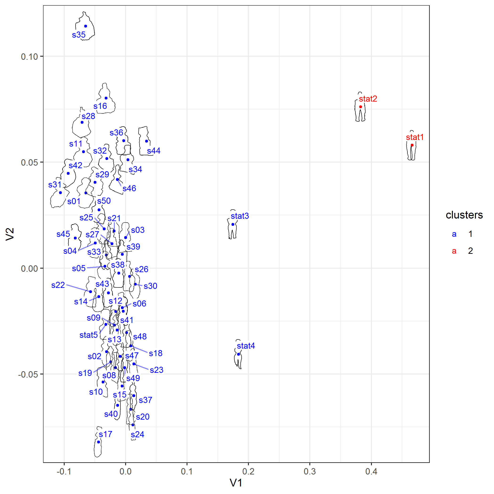

```{r setup, include=FALSE}
library(knitr)
library(kableExtra)
library(dplyr)
knitr::opts_chunk$set(echo = FALSE,  fig.align="center", fig.width = 12, fig.height = 12)
```

Si les mots on un sens (plutôt que seulement des usages), il faudrait se pencher un peu plus vers l'étymologie de ces deux termes: écologie et économie. Leur caractère conflictuel de nos sociétés modernes reflète mal que ces deux notions sont formées sur l' *oikos* (eco). En fait ce qui les fait différer c'est que le *logos* (d'écologie) réfère à des lois qui s'impose aux hommes et aux femmes, alors que le *nomos* (de économie) réfère à des lois que les hommes et aux femmes se sont donnés d'eux-mêmes. Selon moi, l'exaptation de la nature, via la technique, reste le grand mystère à éclaircir

Je suis un archéologue très impliqué dans les sciences informatiques, suivant mon credo  (il y a une **histoire naturelle des sociétés humaines**), je développe des formalismes en sciences humaines, statistiques, visualisation de données, etc. pour mettre en évidence les régularités des distributions. 

# Curriculum Vitae

Mon [CV](https://github.com/zoometh/thomashuet.github.io/raw/main/cv/cv_english.pdf)

# Archaeological researches

I have participate to various projects where a certain degree of formalism was expected to identify reccurent and significative patterns

## Rock-art

<!-- http://www.prehistoire.org/shop_515-40342-2674-822/m63-2017-les-gravures-piquetees-du-mont-bego-alpes-maritimes-organisation-spatiale-et-seriation-vie-iie-millenaire-av.-j.-c.-t.-huet.html -->

The mont Bego site is one of the major concentration in Western Europe with near to 4,000 engraved rocks.

```{r lf.Sectors}
# load the lf map from img/CdT.html
# knitr::include_url("https://yihui.shinyapps.io/miniUI/")
# knitr::include_app(paste0(getwd(),"/img/m.html"), height = '600px')
# htmltools::includeHTML("https://github.com/zoometh/bego/blob/main/img/Bego.html")
```

There's 20,000 figurative engravings. 


I started to develop the **[Bego app]("https://zoometh.github.io/bego/")** to allow the general public to prepare a visit to the site.

## Anthropomorphic flint bladelets

Ibañez *et al.*, published a comprehensive study of the context of PPNB flint bladelets found in Kharaysin (Jordania)[ in *Antiquity* (2020)](https://www.cambridge.org/core/journals/antiquity/article/flint-figurines-from-the-early-neolithic-site-of-kharaysin-jordan/FFEB57291718AF9FF216F1113844C61B) question the anthropomorphism of these first societies of farmers.  


```{r df, fig.width= 7, fig.cap="Kharaysin bladelets, credits: Kharaysin project"}
knitr::include_graphics('img/kharaysin_bladelets.png')
```

The dataset was compared to Aïn Ghazal statues and busts (PPNB). A shape analysis of the  , dated to , with a procustre analysis made on the whole contour (not only some landmarks)
The shapes of the flint bladelets from Kharaysin mix together with the statues and busts from the near Aïn Ghazal site

```{r tyr, fig.width= 7, fig.cap="Kharaysin bladelets, credits: Kharaysin project"}

# library(cowplot)
# fig_svg<-cowplot::ggdraw()+cowplot::draw_image("img/mds.svg")
# plot(fig_svg)
# dist.meth <- "euclidian" # "euclidian"
# clust.meth <- "complete" # "ward.D2", "complete", "min"
# mat1 <- 'D:/Cultures_9/PPNB/(Etude)/resultats/distance_matrix_part1.jpg'
# include_graphics(mat1)
```

# IT development

I am used to programm in R and Python, also using markup languages (LaTeX, HTML, etc.), the GitHub platform, GIS and database. I am also familiar with network analysis, shape analysis and 3D/photogrammetry

## Interactive web apps

I've developed **3** RShiny apps based on [R](https://www.r-project.org/) and [Leaflet](https://leafletjs.com/):

```{r Rshiny.apps}
shiny.apps.df <- data.frame(name=c("EUROEVOL_R",
                                "NeoNet",
                                "Bego"),
                         topic=c("Radiocarbon mapping",
                                 "Radiocarbon mapping",
                                 "Rock-art mapping"),
                         web.url=c("https://zoometh.github.io/C14/",
                                   "https://zoometh.github.io/C14/neonet",
                                   "https://zoometh.github.io/bego/"),
                         app.url=c("https://neolithic.shinyapps.io/Euroevol_R/",
                                   "https://neolithic.shinyapps.io/NeoNet/",
                                   "None"))
kable(shiny.apps.df,"html") %>% 
  kable_styling(full_width = FALSE, position = "center", font_size=12)
```


## The **iconr** R package

I am developping of a R package with [Jose Pozo](https://orcid.org/0000-0002-0759-3510) and [Craig Alexander](https://www.researchgate.net/profile/Craig_Alexander2). This package has the working name of 'decorr' (soon: 'iconr'). Its purpose is to:

1. map an iconographical content with a relative neighborhood graphs (RNG) created in a GIS
2. compare iconographical composition based on quantitative indices coming from Graph theory (degrees, betweeness, etc.) and spatial analysis (average heights, etc.)

| {width=500px} |
|:--:| 
| common edges (in red) between two Late Bronze stelae |


