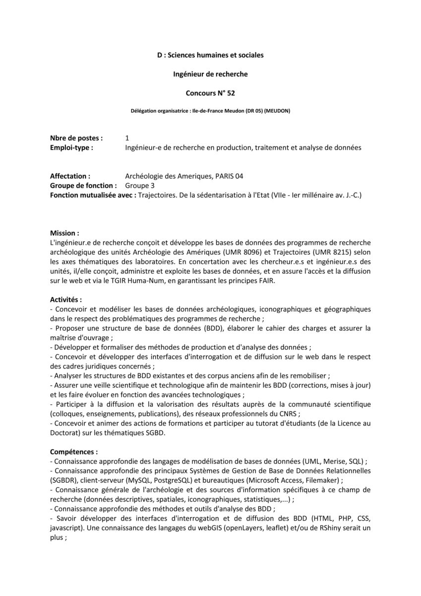
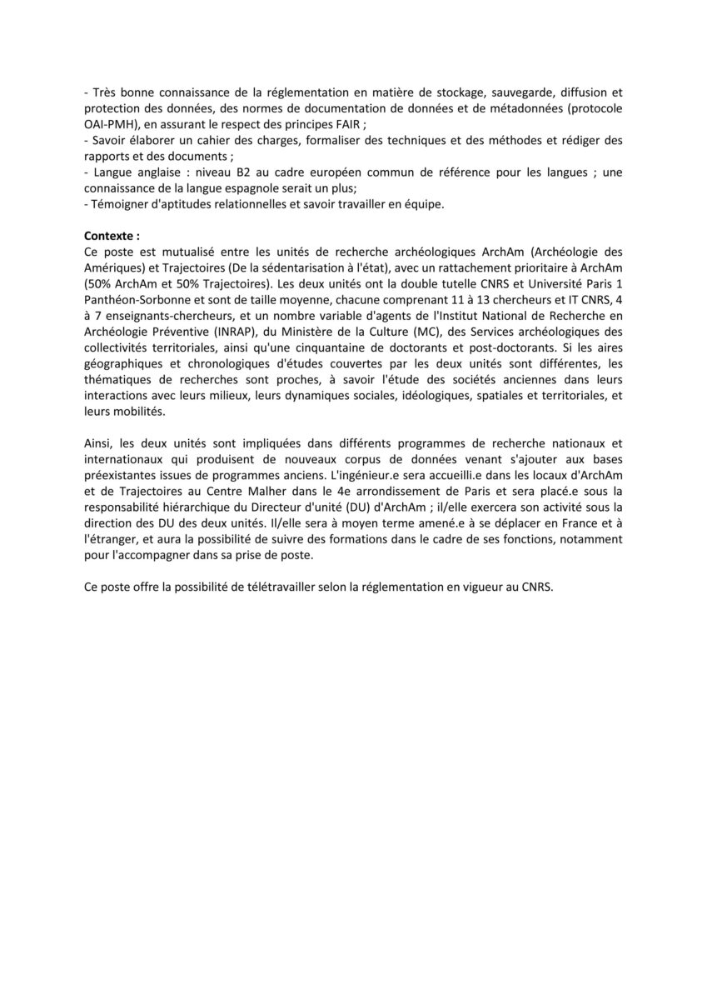
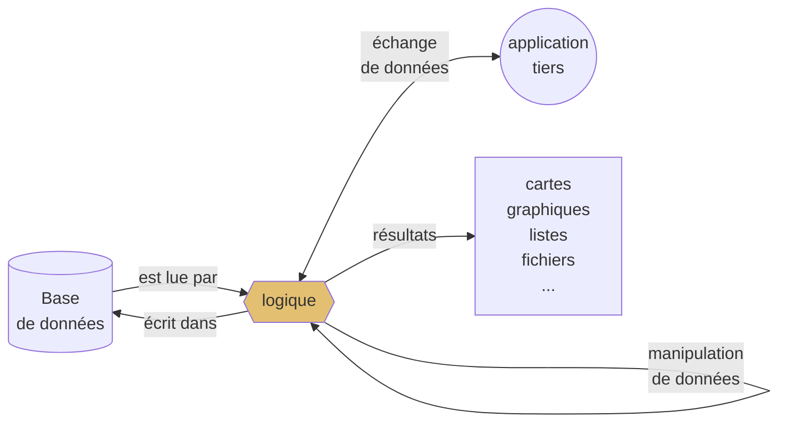

# IR ArchAm-Trajectoires
> 2023

Poste d'Ingénieur de Recherche (IR) CNRS BAP D (Sciences humaines et sociales) en production, traitement et analyse de données, mutualisé entre [ArchAm](https://archam.cnrs.fr/) (50%) et [Trajectoires](https://trajectoires.cnrs.fr) (50%). Concours n 52

[Profil IR en production, traitement et analyse de données](https://github.com/zoometh/thomashuet/tree/main/profiles/arcam-traject#production-traitement-et-analyse-de-donn%C3%A9es---d1a41)

## Admissibilité
> Coefficient: 1/3

Étude par le jury du dossier de candidature comprenant un relevé des diplômes, titres et travaux

## Admission
> Coefficient: 2/3

Audition (oral) débutant par un [exposé](https://github.com/zoometh/thomashuet/tree/main/profiles/arcam-traject#expos%C3%A9) de la candidate et du candidat sur son cursus et ses motivations et se poursuivant par un entretien avec le jury. L'[entretien](https://github.com/zoometh/thomashuet/tree/main/profiles/arcam-traject#entretien) est destiné à apprécier les aptitudes et les compétences de la candidate et du candidat à occuper l’emploi mis au concours. Il tient compte de la spécificité des emplois à pourvoir

## Exposé

10 minutes présentation: cursus et ses motivations

## Entretien

20 minutes de questions

---
# Profil Ingénieur-e de recherche (IR) CNRS

* Exerce des responsabilités dans les domaines scientifiques, techniques et administratifs des établissements publics scientifiques et technologiques. 
* Assure des missions de conception et de coordination d'activités et de conduite de projets d'envergure. 
* Peut assurer des fonctions de direction et d'encadrement au sein de ces établissements. 
* Définit et conduit les diverses activités techniques et administratives qui concourent à la réalisation d'un programme de recherche. 
* Participe à la mise en œuvre des activités de recherche, de valorisation et de diffusion de l'information scientifique et technique. 
* Peut être chargé de toute étude ou mission de coopération internationale, d'enseignement ou d'administration de la recherche.

### Production, traitement et analyse de données - D1A41
> https://metiersit.dsi.cnrs.fr/index.php?page=ficheemploitype&codeEmploi=D1A41&idFamillePro=14&codeBAP=D&codeFamille=A
#### Mission

* Concevoir (en lien avec l'équipe de recherche en science humaine et sociale ou en réponse à une demande externe) et piloter des dispositifs de recherche ou d'études ; développer et conduire des méthodes d'exploitation, d'analyse de bases de données ou de corpus et en assurer la valorisation ; garantir la qualité et la validité des données produites et des traitements réalisés.
* Facteurs d'évolution à moyen terme
* Émergence de pôles de recherche pluridisciplinaire
* Accroissement des activités de valorisation et de diffusion scientifique
* Diversification des terrains et objets d'études, des types de données et corpus
* Direction ou participation à la direction d'une équipe de recherche ou d'un laboratoire

#### Activités principales
* Concevoir et piloter un dispositif de recherche
* Proposer une démarche adaptée à un objet d'étude
* Piloter des études
* Assurer la maîtrise d'ouvrage du développement de bases de données ou de corpus
* Développer des outils d'interrogation et d'interface entre différentes bases de données ou corpus
* Développer et formaliser des méthodes permettant la production ou l'analyse des données ou de corpus
* Mettre en œuvre des méthodes ou protocoles pour le recueil de données ou de corpus, en assurer l'analyse et interpréter les résultats
* Participer ou animer des réseaux professionnels
* Analyser les demandes externes et évaluer leur pertinence par rapport aux orientations scientifiques
* Participer ou coordonner la réponse à des appels d'offre
* Coordonner les moyens humains, techniques et financiers nécessaires à la réalisation du projet de recherche
* Transférer ses compétences dans le cadre d'actions de formation (formation continue, à la recherche, des étudiants)
* Valoriser les réalisations et les résultats sous forme de publications scientifiques, rapports, de présentations orales…
* Organiser des manifestations scientifiques
* Contribuer à la réflexion sur les techniques et les méthodes
* Concevoir et réaliser une veille scientifique et méthodologique

#### Compétences principales

##### Connaissances
* Connaissance d'un domaine disciplinaire ou interdisciplinaire (connaissance approfondie)
* Langage de modélisation, manipulation et publication de données en sciences humaines (connaissance approfondie)
* Méthodes et outils en production de données (connaissance approfondie)
* Méthodes et outils en traitement et analyse des données (connaissance approfondie)
* Systèmes de gestion de base de données (connaissance générale)
* Environnement et réseaux professionnels (connaissance générale)
* Cadre légal et déontologique (connaissance approfondie)
* Archivage pérenne de données de recherche (application)
* Techniques de présentation écrite et orale
* Langue anglaise : B2 (cadre européen commun de référence pour les langues)

##### Compétences opérationnelles
* Savoir élaborer des outils de collecte (questionnaires, entretiens, études de cas, observations de terrain, monographies...)
* Savoir exploiter une base de données (manipulation de données, extraction de données pertinentes, fusion de bases)
* Savoir localiser, répertorier, analyser et critiquer les données (savoir statuer sur la pertinence des données ou des sources)
* Connaître les normes de documentation de données
* Savoir formaliser des techniques et des méthodes
* Rédiger des rapports ou des documents
* Mettre en œuvre une démarche qualité
* Élaborer un cahier des charges

#### Diplôme réglementaire exigé - Formation professionnelle si souhaitable
* Doctorat, diplôme d'ingénieur

#### Conditions particulières d'exercice
* Obligation de respecter le secret statistique ou professionnel dans le cadre législatif existant
* Déplacements en France et à l'étranger

---

## En +

