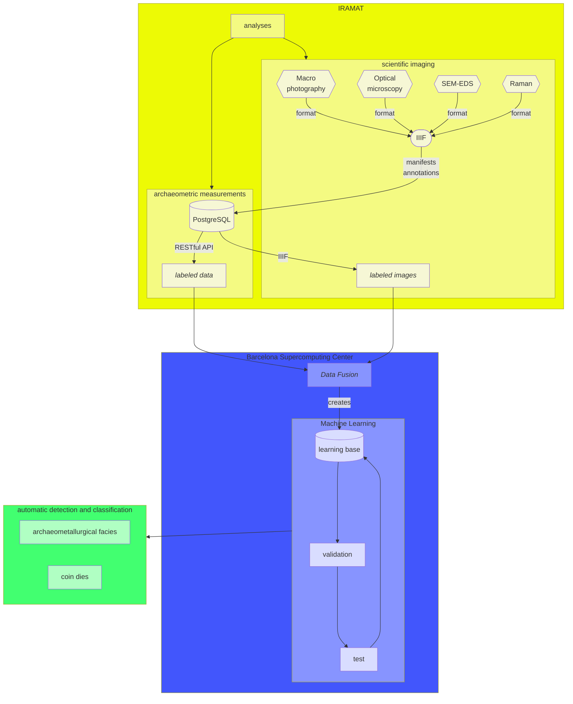

```mermaid
flowchart TD
  subgraph IRAMAT[IRAMAT]
    BD[(PostgreSQL)]
    analyses
    analyses --> IRAMATdata
    analyses --> IRAMATimg
    subgraph IRAMATdata[archaeometric measurements]
        BD -- RESTful API --> APIdata[<em>labeled data</em>]
    end
    subgraph IRAMATimg[scientific imaging]
        Macro{{Macro<br>photography}} -- format --> IIIF([IIIF])
        Opt{{Optical<br>microscopy}} -- format --> IIIF
        MEB{{SEM-EDS}} -- format --> IIIF
        Raman{{Raman}} -- format --> IIIF
        IIIF -- manifests<br>annotations --> BD
        BD -- IIIF --> IIIFmanifest[<em>labeled images</em>]
    end
  end
  APIdata ---> PyExtract[<em>Data Fusion</em>]
  IIIFmanifest ---> PyExtract
  subgraph BSC[Barcelona Supercomputing Center]
    PyExtract -- creates --> MLlearn[(learning base)]
    subgraph ML[Machine Learning]
      MLlearn ---> MLvalid[validation]
      MLvalid ---> MLtest[test]
      MLtest --> MLlearn
    end
  end
    subgraph out[automatic detection and classification]
      ResMet[archaeometallurgical facies]
      ResNum[coin dies]
    end
  ML ---> out

style BD fill:#cccccc

style IRAMAT fill:#edfa05
style analyses fill:#f4fa82
style IRAMATdata fill:#f4fa82
style IRAMATimg fill:#f4fa82
style Macro fill:#f6f7d5
style Opt fill:#f6f7d5
style MEB fill:#f6f7d5
style Raman fill:#f6f7d5
style IIIF fill:#f6f7d5
style IIIFmanifest fill:#f6f7d5
style BD fill:#f6f7d5
style APIdata fill:#f6f7d5

style BSC fill:#4256fc
style PyExtract fill:#8794ff
style ML fill:#8794ff
style MLlearn fill:#d9ddff
style MLvalid fill:#d9ddff
style MLtest fill:#d9ddff

style out fill:#42ff70
style ResMet fill:#b0ffc3
style ResNum fill:#b0ffc3
```