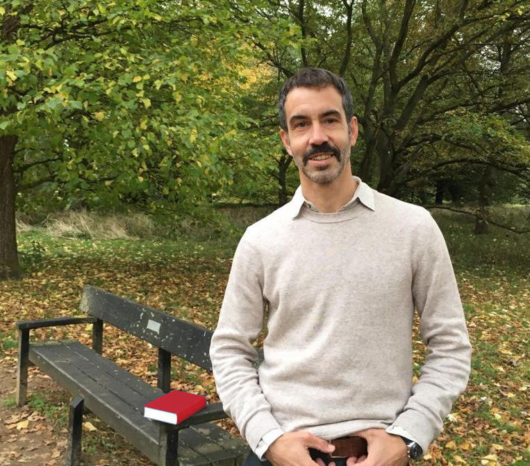

# Thomas HUET 

## Thomas Huet

Thomas Huet est docteur en archéologie de l’Université Nice Sophia-Antipolis (2012). Dans le cadre de son postdoc LabEx ARCHIMEDE (2015-16), il a initié le développement de l'application *iconr* destinée a mesurer précisément les différences iconographiques entre différents supports. Il est actuellement chercheur et responsable base de données à University of Oxford (2021). 

Thomas mène des recherches sur la Pré- et Protohistoire du Bassin méditerranéen et plus particulièrement sur les systèmes iconographiques. Il développe des applications informatiques, notamment pour l'intégration, la structuration, l'extraction, l'analyse et la modélisation des données.

### *lien externe*
[GitHub](https://github.com/zoometh/thomashuet#dr-thomas-huet-)
