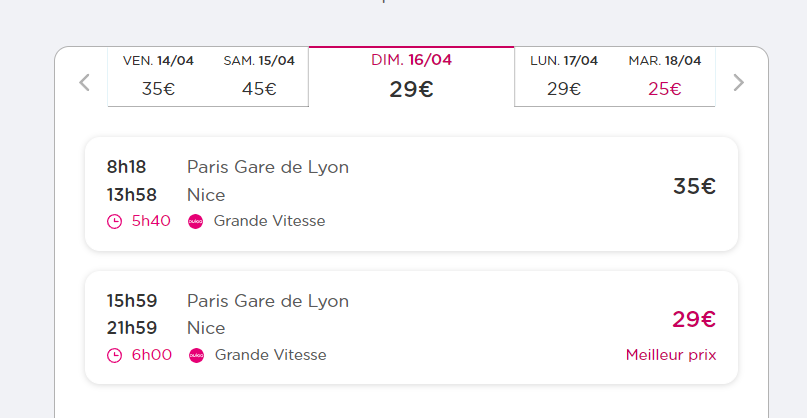
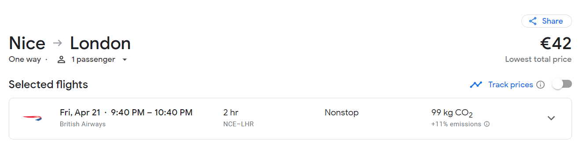

## CAA23 and GMPCA23 conference (2-6 April and 17-21 April) 
> Thomas Huet

## Travel plan

* Oxford -> London
2 April - 🚂15€ x 1

* London -> Amsterdam
2 April - 🚂57€ x 1
https://www.eurostar.com/search/rw-en?origin=7015400&destination=8400058&adult=1&child=&infant=&youth=&outbound=2023-04-02&country=es

---

CAA23 Conference https://2023.caaconference.org/
2 April - 6 April
🏠~150€ x 5 = 750€
https://sp.booking.com/hotel/nl/internationaal.ca.html?aid=1796694&label=53807696&sid=a09235b9df17970b0eb4b3fd79a9bc8c&all_sr_blocks=1079805_95129459_2_0_0;checkin=2023-04-02;checkout=2023-04-06;dest_id=-2140479;dest_type=city;dist=0;group_adults=1;group_children=0;hapos=1;highlighted_blocks=1079805_95129459_2_0_0;hpos=1;matching_block_id=1079805_95129459_2_0_0;no_rooms=1;req_adults=1;req_children=0;room1=A;sb_price_type=total;sr_order=popularity;sr_pri_blocks=1079805_95129459_2_0_0__47174;srepoch=1673602397;srpvid=0fab432d196c021e;type=total;ucfs=1&#hotelTmpl

---

* Amsterdam -> Paris

---
(work from home)
---

* Paris -> Nice
16 April - 🚂30€ x 1

---

GMPCA Conference  https://gmpca.fr/colloques-d-archeometrie
17 April - 21 April
🏠~ 70€ x 4 = 280€
https://www.airbnb.com/rooms/53733809?adults=1&location=Nice%2C%20France&check_in=2023-04-17&check_out=2023-04-21&federated_search_id=941618bf-f167-474c-a8d4-0d2e3faf476b&source_impression_id=p3_1673601695_dENMH0ppuh2OEP9Y

---

* Nice -> London
21 April - ✈️50€ x 1

* London -> Oxford
21 April - 🚂15€ x 1

## Total cost

~ 1,197€ 

