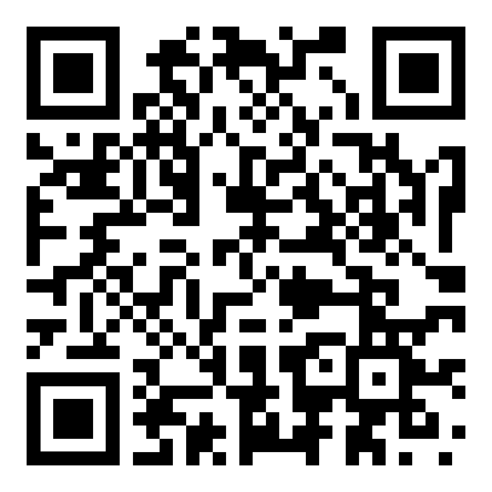

# S12. Chronological modelling: formal methods and research software

&emsp;Eythan Levy, University of Bern, Department of Jewish Studies 
&emsp;Thomas Huet, University of Oxford, School of Archaeology 
&emsp;Florian Thiery, Römisch-Germanisches Zentralmuseum, Department of Scientific IT 
&emsp;Allard W. Mees, Römisch-Germanisches Zentralmuseum, Department of Scientific IT

Time and its analysis are at the heart of archaeology: one of the main objectives of the archaeologist is the establishment of a temporal framework for a given layer, site or material culture. But archaeology covers such a wide range of cultures, dispersed both in time and space, that contextual chronological assessments are constructed using very different tools, languages and techniques. It creates as many different temporal and cultural frameworks as there are specialties, with notable differences in approaches depending on whether one is dealing with absolute or relative chronology, laboratory techniques or cultural approaches, deterministic or statistical methods (Buck and Millard 2004). The aim of this session is to explore a wide variety of research tools and techniques related to (semantic) chronological modelling in archaeology in order to identify common methodological frameworks and to build bridges between specialties. This also invites approaches from CAA Special Interest Groups (SIG), e.g. on Scientific Scripting Languages in Archaeology (SSLA) and Semantics and LOUD in Archaeology (Data Dragon) as well as from the CAA Little Minions on chronological modelling. These SIGs are following the FAIR (Bahin et al. 2020) and FAIR4RS (Hong et al. 2022) principles in the idea of Open Science, including Open Access, Open (Research) Data and Open Source (Research) Software.

We invite papers in all fields related to time/chronology research, including:

**Bayesian modelling**. Bayesian modelling has revolutionized the way radiocarbon dating is practised nowadays (Buck et al. 1991; Bronk Ramsey 2009). The introduction of known priors (e.g., stratigraphic sequences, termini post/ante quem) into the radiocarbon calibration process enables researchers to obtain much more precise dating intervals than previously, when radiocarbon samples were individually calibrated rather than incorporated into a model. Many software tools are currently available for Bayesian modelling in archaeology, such as OxCal, BCal, ChronoModel, as well as R and Python packages. 

**Stratigraphic modelling**. The most famous tool for stratigraphic modelling is the Harris matrix (Harris 1989), which has been the focus of much software development (Harris Matrix Composer, Stratify, Stratifiant, …). Originally designed as a tool restricted to relative chronology, the Harris matrix has also seen developments aimed at extending this formalism to include absolute dating elements (see for example Desachy 2016). Similar efforts have extended the model’s power to be able to automatically detect temporal relations between stratigraphic units (see for example the Phaser tool). 

**Temporal logics**. Temporal logics is an important field of mathematical and computer science research (Demri et al. 2016), which has up to now found too little applications in archaeological research, probably due to a lack of communication between the relevant research communities. The main results of temporal logics widely applied and cited by archaeologists (see for example Holst 2004; May 2020) are the fundamental, but old, Allen relations (Allen 1984, 1991). The archaeological research community has otherwise only brought too little attention to recent research results in temporal logics. 

**Seriation techniques**. A classical way to provide relative chronology between artifacts, even in the absence of stratigraphic information, is seriation (O’Brien and Lyman 1999). In its variant called frequency seriation, the relative frequencies of each type of artifacts found within the same layer are computed and presented in chart form. The relative order between these layers (possibly coming from different sites, thus not featuring a relative stratigraphic order with each other) can then be established using the hypothesis of unimodality of artifact production. Seriation is an old but powerful method, which seems to have fallen out of fashion in many fields of Old World archaeology, but that still saw significant advances in the last decades (see for example Lipo, Madsen and Dunnell 2015). 

**Chronological networks**. Until recently, little attention had been brought to the application of deterministic (i.e. non-statistical) techniques to building wide regional chronologies, based on historical data and cultural synchronisms. The goal of such techniques is to automate the archaeological cross-dating process by encoding a network of chronological relationships between temporal entities, and using algorithms to build the global chronology by propagating along the network a set of absolute dates located at specific nodes of the network. This approach has recently been implemented by two software tools: Groundhog (Falk 2016, 2017, 2020) and ChronoLog (Levy et al. 2021a, 2021b), relying on different techniques (exhaustive search and graph-theoretic techniques, respectively). 

**Linked Open Time Data (LOTD)**. Chronological Linked Open Data provides chronological space-time-gazetteers, e.g. PeriodO, GODOT and ChronOntology, and standard formats and ontologies, e.g. RDF, OWL TIME, EDTF, and CIDOC CRM, Alligator Ontology, AMT Time Ontology. LOTD and open source research tools allow for reproducible research, the unveiling of “hidden assumptions” in archaeological data and the semantic modelling of fuzziness and wobbliness. An example could be statistical approaches such as the horseshoe paradigm using correspondence analysis and the application of temporal logics to do temporal reasoning (Madsen 1998; Thiery and Mees 2018).

**Other approaches**. A host of other formal approaches to chronological modelling and computation have been explored in the recent years, such as fuzzy logics (Niccolucci and Hermon 2015), aoristic analysis (Crema 2012), and evidence density estimation (Demján and Dreslerová 2016). 

We welcome papers dealing with new theoretical, methodological and research software developments in any of the above fields, in order to promote shared practices and the discovery of new ideas and paradigms.

### References

Allen, J.F. 1984. Towards a general theory of action and time. Artificial Intelligence 23: 123–154.

Allen, J.F. 1991. Time and time again: the many ways to represent time. International Journal of Intelligent Systems 6(4): 341–355.

Bahim, C., Casorrán-Amilburu, C., Dekkers, M., Herczog, E., Loozen, N., Repanas, K., Russell, K. and Stall, S., 2020. The FAIR Data Maturity Model: An Approach to Harmonise FAIR Assessments. Data Science Journal 19(1): 41. DOI: http://doi.org/10.5334/dsj-2020-041 

Bronk Ramsey, C. 2009. Bayesian analysis of radiocarbon dates. Radiocarbon 51: 337–360.

Buck, C.E., Kenworthy, J.B., Litton, C.D. and Smith, A.F.M. 1991. Combining archaeological and radiocarbon information: a Bayesian approach to calibration. Antiquity 65: 808–21.

Buck, C.E. and Millard, A. 2004. Tools for Constructing Chronologies: Crossing Disciplinary Boundaries. London.

Chue Hong, N. P., Katz, D. S., Barker, M., Lamprecht, A-L, Martinez, C., Psomopoulos, F. E., Harrow, J., Castro, L. J., Gruenpeter, M., Martinez, P. A., Honeyman, T., et al. (2022). FAIR Principles for Research Software version 1.0. (FAIR4RS Principles v1.0). Research Data Alliance. DOI: https://doi.org/10.15497/RDA00068 

Crema, E.R. 2012. Modelling temporal uncertainty in archaeological analysis. Journal of Archaeological Methods and Theory 19: 440–461.

Demján, P. and Dreslerová, D. 2016. Modelling distribution of archaeological settlement evidence based on heterogeneous spatial and temporal data. Journal of Archaeological Science 69: 100–109.

Demri, S., Goranko, V. and Lange, M. 2016. Temporal Logics in Computer Science: Finite-State Systems (Cambridge Tracts in Theoretical Computer Science). Cambridge.

Desachy, B. 2016. From observed successions to quantified time: formalizing the basic steps of chronological reasoning. Acta Imeko 5: 4–13.

Falk, D.A. 2016. Groundhog: A Computer test laboratory to validate chronological hypotheses. Research poster presented at the 2016 Annual Meeting of the American Schools of Oriental Research (ASOR). http://www.groundhogchronology.com/poster.pdf (accessed 23/9/2021).

Falk, D.A. 2017. Evaluating chronological hypotheses by computer analysis in light of low and middle chronological frameworks. Abstract of a paper presented at the 2017 Annual Meeting of the American Schools of Oriental Research (ASOR). https://www.asor.org/wp-content/uploads/2019/01/ASOR-Program-2017.pdf (accessed 23/9/2021).

Falk, D.A. 2020. Computer analytics in chronology testing and its implications for the date of the Exodus. In: Averbeck, R.E., Younger Jr, K.L., eds. “An Excellent Fortress for His Armies, a Refuge for the People”, Egyptological, Archaeological, and Biblical Studies in Honor of James K. Hoffmeier. University Park, PA: 99–111.

Harris, E. 1989. Principles of Archaeological Stratigraphy (second edition). London.

Holst, M.K. 2004. Complicated relations and blind dating: formal analysis of relative chronological structures. In: Buck, C.E. and Millard, A.R., eds. Tools for Constructing Chronologies. London: 129–147.

Levy, E., Geeraerts, G., Pluquet, F., Piasetzky, E. and Fantalkin, A. 2021a. Chronological networks in archaeology: a formalised scheme. Journal of Archaeological Science 127: article 105225.

Levy, E., Piasetzky, E. and Fantalkin, A. 2021b. Archaeological cross dating: a formalized scheme. Archaeological and Anthropological Sciences 13: article 184.

Lipo, C.P., Madsen, M.E. and Dunnell, R.C. 2015. A Theoretically-Sufficient and Computationally- Practical Technique for Deterministic Frequency Seriation. PLoS ONE, 10(4): 1–31.

Madsen, T. 1988. Multivariate statistics and archaeology. In: Madsen, T. (ed.), Multivariate Archaeology. Numerical Approaches in Scandinavian Archaeology. Jutland Archaeological Society Publications 21, 7-28.

May, K. 2020. The Matrix: Connecting Time and Space in Archaeological Stratigraphic Records and Archives. Internet Archaeology 55. https://doi.org/10.11141/ia.55.8 (accessed 3/10/2021).

Niccolucci, F. and Hermon, S. 2015. Time, chronology and classification. In: Barcelo, J.A. and Bogdanovic, I., eds. Mathematics and Archaeology. Boca Raton: 257–271.

O’Brien, M.J. and Lyman, R. L. 1999. Seriation, stratigraphy, and index fossils: the backbone of archaeological dating. New York.

Thiery, F. and Mees, A. 2018. Taming the chronology of South Gaulish Samian found at Hadrian’s Wall and the German Limes using Linked Open Data, UK Chapter of Computer Applications and Quantitative Methods in Archaeology (CAA-UK 2018), Edinburgh, Scotland, 26th October 2018. DOI: 10.5281/zenodo.1469298.